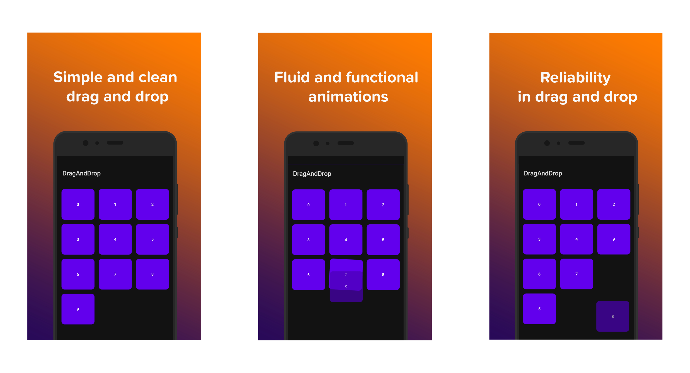

## DragDrop
Drag and drop with all views

[](http://kotlinlang.org)
[](https://developer.android.com/jetpack/androidx/)
[](./../../releases)
[](https://opensource.org/licenses/MIT)
[](https://www.codacy.com/gh/fctaddia/DragDrop/dashboard?utm_source=github.com&amp;utm_medium=referral&amp;utm_content=fctaddia/DragDrop&amp;utm_campaign=Badge_Grade)

---



### How does it work
Just add the DragDropLayout object in your xml layout.
```xml
<it.kenble.draganddrop.design.drag.DragDropLayout
  android:id="@+id/gridLayout"
  android:layout_marginTop="@dimen/margin10"
  android:layout_width="match_parent"
  android:layout_height="wrap_content" />
```
I recommend not to add the objects inside the layout directly in the xml but I have specifically created a function to dynamically add views to the DragDrpLayout.<br>
Once you have created the xml layout and added the views to the layout with Kotlin, remember to call this function otherwise you will not be able to use drag and drop.
```Kotlin
binding.gridLayout.init()
```
### Conclusions
Perfect now enjoy using drag and drop in your apps.
